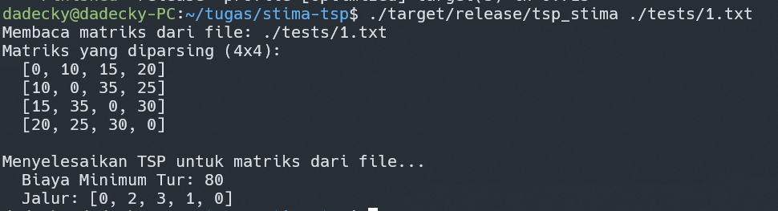
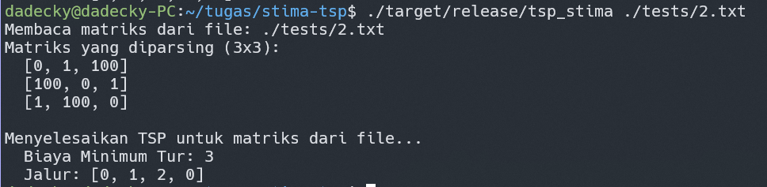
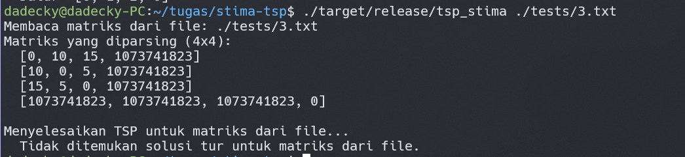
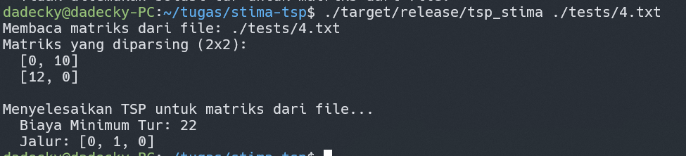
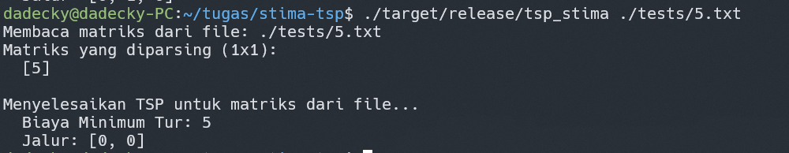

# Penyelesaian Travelling Salesman Problem (TSP) menggunakan Rust

Program ini bertujuan untuk menyelesaikan Traveling Salesman Problem (TSP) menggunakan pendekatan pemrograman dinamis (dynamic programming), yaitu algoritma Held-Karp. Diberikan sebuah graf lengkap dengan bobot (biaya) pada setiap sisinya, program akan mencari tur Hamilton dengan total biaya minimum yang mengunjungi setiap simpul (kota) tepat satu kali dan kembali ke simpul awal.

## Cara Kerja (Ringkas)

Algoritma yang digunakan adalah algoritma Held-Karp, sebuah algoritma pemrograman dinamis yang memiliki kompleksitas waktu `O(N² \* 2^N)`, di mana N adalah jumlah simpul (kota).

Secara singkat, algoritma ini bekerja dengan cara:

1. Membangun solusi secara bertahap.
2. `dp[mask][i]` menyimpan biaya minimum dari tur yang dimulai dari simpul awal, mengunjungi semua simpul dalam `mask` (representasi bitmask dari himpunan simpul yang dikunjungi), dan berakhir di simpul `i`.

3. Iterasi dilakukan melalui semua kemungkinan `mask` dan semua kemungkinan simpul akhir `i` dalam `mask` tersebut.

4. Setelah tabel `dp` terisi, biaya tur TSP minimum ditemukan dengan mempertimbangkan biaya kembali ke simpul awal dari semua kemungkinan simpul terakhir.

5. Jalur optimal kemudian direkonstruksi berdasarkan pilihan yang disimpan selama pengisian tabel `dp`.

## Persyaratan

- Rust: Pastikan Anda telah menginstal Rust dan Cargo. Anda dapat mengunduhnya dari [rust-lang.org](https://www.rust-lang.org/).

## Cara Kompilasi (Build)

Untuk mendapatkan performa terbaik, kompilasi program dalam mode rilis:

```sh
cargo build --release
```

Executable akan tersedia di direktori `target/release/tsp_stima`.

## Cara Penggunaan
Program menerima satu argumen baris perintah, yaitu path menuju file teks yang berisi matriks ketetanggaan (adjacency matrix) dari graf.

### Format Perintah:
```sh
./target/release/tsp_stima <path_ke_file_input.txt>
```
### Contoh:
```sh
./target/release/tsp_stima ./tests/1.txt
```
Jika tidak ada argumen file yang diberikan, program akan menjalankan beberapa contoh kasus uji bawaan.


### Format File Input:
File input harus berupa file teks yang berisi matriks ketetanggaan.

- Setiap baris merepresentasikan satu baris dari matriks.
- Angka-angka dalam satu baris dipisahkan oleh spasi.
- `matriks[i][j]` adalah biaya dari simpul `i` ke simpul `j`.
- Jika tidak ada jalur langsung antara dua simpul atau jalur tersebut tidak diinginkan, gunakan angka yang sangat besar (misalnya, `1073741823` yang setara dengan `i32::MAX / 2`, yang digunakan sebagai `INF` internal oleh program ini).
- Nilai pada diagonal (misalnya, `matriks[i][i]`) biasanya `0` atau biaya yang sangat tinggi jika perjalanan ke diri sendiri tidak relevan atau tidak mungkin.

## Contoh Kasus Uji
1. `./target/release/tsp_stima ./tests/1.txt`
- Deskripsi: Graf simetris standar 4x4 yang sering digunakan sebagai contoh.
- Hasil:


2. `./target/release/tsp_stima ./tests/2.txt`
- Deskripsi: Graf kecil 3x3 yang tidak simetris (biaya `A->B` mungkin berbeda dari `B->A`).
- Hasil:


3. `./target/release/tsp_stima ./tests/3.txt`
- Deskripsi: Graf 4x4 di mana beberapa jalur memiliki biaya sangat tinggi, yang secara efektif membuatnya terputus untuk tur TSP yang masuk akal. Ini menguji bagaimana program menangani kasus di mana tidak ada tur dengan biaya rendah yang dapat ditemukan.
- Hasil: 


4. `./target/release/tsp_stima ./tests/4.txt`
- Deskripsi: Kasus sederhana dengan hanya dua node.
- Hasil: 


5. `./target/release/tsp_stima ./tests/5.txt`
- Deskripsi: Kasus paling dasar dengan satu node. Tur adalah dari node tersebut kembali ke dirinya sendiri.
- Hasil: 


## Batasan
- Karena kompleksitas waktu O(N² * 2^N), program ini praktis untuk jumlah simpul (N) yang relatif kecil (misalnya, N <= 20-22). Untuk N yang lebih besar, waktu eksekusi akan menjadi sangat lama.
- Program mengasumsikan graf lengkap. Jika ada pasangan simpul yang tidak memiliki jalur langsung, Anda harus merepresentasikannya dengan biaya yang sangat tinggi dalam file input `(1073741823)`.